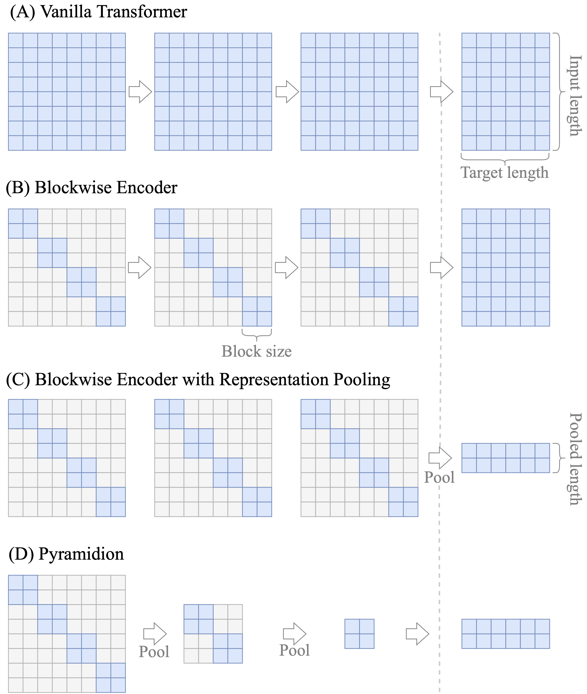

# Sparsifying Transformer Models with Trainable Representation Pooling

This repository contains a demonstrative implementation for pooling-based models, e.g., DeepPyramidion
complementing our paper _Sparsifying Transformer Models with Trainable Representation Pooling_. 

The detailed README on how to use it is provided in [examples](./fairseq/examples/deep_pyramidion/README.md). See [fairseq/examples/deep_pyramidion](./fairseq/examples/deep_pyramidion/) for more.

[[arXiv](https://arxiv.org/abs/2009.05169), [BibTeX](https://dblp.uni-trier.de/rec/journals/corr/abs-2009-05169.html?view=bibtex)]

## General information

The method we propose is inspired by this search for relevant fragments, which is an important aspect of human cognition when engaged in *reading to do* actions. We intend to mimic relevance judgments and hypothesize that it is possible to answer problems involving natural language with only selected passages of the input text.

These passages may be of substantially shorter length than the original text. One may compare this to a person reading the paper and highlighting in such a way that it is possible to provide a summary using only the highlighted parts.

The end-to-end mechanism we introduce performs such highlighting by scoring the representations and passes only the selected ones to the next layer of the neural network.

**Figure.** *An illustration of sparse attention matrices assuming a three-layer encoder and decoder (separated by the dashed line). The blue color reflects the memory consumption of self-attention (encoder) and cross-attention (decoder).
(A) The complete input consumed at once.
(B) Memory reduced with blockwise attention and
(C) pooling applied after the encoder.
(D) Gradual reduction of memory by pooling after every layer.*
